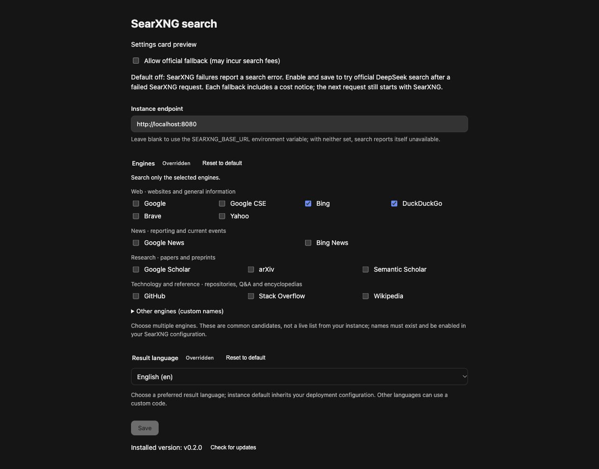

# Free & Private Web Search for DeepSeek Harness

**English** | [中文](README.zh.md)

[](LICENSE)
[](https://nodejs.org)
[](https://github.com/searxng/searxng)
[](https://github.com/deepseek-ai/deepseek-harness)

Give [DeepSeek Harness](https://github.com/deepseek-ai/deepseek-harness) (dsh) web search through your own self-hosted [SearXNG](https://github.com/searxng/searxng) instance.

✅ **No API key**
✅ **No per-search API cost**
✅ **Self-hosted & private** — queries go to *your* instance, nowhere else
✅ **Configure directly in DSH Settings** — *Settings → Plugins → SearXNG search*
✅ **Tested end-to-end against the official web search** — [no quality difference observed](docs/quality-benchmark.md)



*Preview of the SearXNG search card in Settings → Plugins — grouped engine choices and a result-language dropdown. Save to apply changes to the next search without a restart.*

## Quick Start

Prerequisite: use DSH with the [companion host integration](host-integration/README.md). A host without these APIs cannot support this uninstall journal.

**1. Install the plugin:**

```sh
dsh plugin --profile <name> add https://github.com/Chaos-Paradox/dsh-web-search-searxng
```

**2. Point it at your SearXNG instance:** open **Settings → Plugins → SearXNG search** and set the endpoint (e.g. `http://localhost:8080`). No instance yet? [2-minute Docker setup](#running-a-searxng-instance).

With the [DSH host integration](host-integration/README.md), installing selects SearXNG by default. Failed searches report an error and make no official search request. To opt in to paid backup, check **Allow official fallback** on the card and save. Uninstall restores the recorded pre-install configuration, preserving any later manual edits as reported conflicts.

## Why use it?

An AI assistant can't browse the web by itself — to let it look things up you normally pay for a hosted search API: billed per query, API key required, queries passing through someone else's servers. This plugin takes a different route: you run a small search relay (SearXNG) on your own machine, and it asks Google, Bing, and 70+ other engines at the same time, then hands the combined results to the agent.

| | Hosted search APIs | **This plugin** |
|---|---|---|
| Cost | Pay per query | **Free** — your instance, your hardware |
| API key | Required, rotates, leaks | **None** |
| Privacy | Queries go to a third party | Queries go to **your** SearXNG, which aggregates 70+ engines for you |
| Rate limit | Yes | Only what your instance allows |
| Works offline / intranet | No | Yes — loopback and private-network endpoints are supported by design |

## Benchmark

**Does answer quality drop?** We benchmarked it end-to-end — a real dsh agent answering with real `web_search` calls, same model and prompts on both sides, blinded judging: **no quality difference observed (two 10-question runs: 6-2-2 and 3-4-3 win/loss/tie; average scores ≈4.8 vs ≈4.4)**. Methodology, per-question data, and honest limitations: [docs/quality-benchmark.md](docs/quality-benchmark.md).

## Architecture

The plugin registers the `searxng` provider into `ctx.web`. Each search starts with `GET {baseURL}/search?format=json`; official search is eligible only after failure with the saved fallback checkbox enabled.

```
┌─────────────┐   web search   ┌──────────────┐   JSON API   ┌────────────────┐
│  dsh agent  │ ─────────────▶ │ ctx.web seam │ ───────────▶ │ your SearXNG   │
│  (LLM)      │ ◀───────────── │  (searxng    │ ◀─────────── │ instance       │
└─────────────┘  sources only  │  provider)   │   results[]  └───────┬────────┘
                               └──────────────┘                      │ aggregates
                                                          ┌──────────▼──────────┐
                                                          │ Google / Bing / DDG │
                                                          │ Brave / 70+ engines │
                                                          └─────────────────────┘
```

SearXNG returns no generated answer, so results carry **sources only** — the agent reads the pages itself with `fetch` when it needs content. Each result maps to a citeable source:

| SearXNG field | dsh source field | Notes |
|---|---|---|
| `url` | `url` | entries without one are dropped |
| `title` | `title` | omitted when blank |
| `content` | `snippet` | the engine's excerpt |
| `publishedDate` | `publishedAt` | when the engine provides it |

`truncated` is always `false` (the web service owns `maxResults` truncation), and no generated `content` answer is attached because SearXNG has none the seam could vouch for.

## Security

- 🔒 **No credentials to leak** — the provider is credential-free by design.
- ⛔ **Redirects fail closed** — HTTP redirects raise `WEB_PROVIDER_ERROR`, so a redirect can never forward your query text to another origin.
- 🏠 **Self-host friendly** — loopback (`http://localhost:8080`), private IPs, and subpath mounts (`http://host/searxng`) all work; `/search` is appended correctly.
- 💬 **Actionable errors** — a 403 response tells you exactly that the instance's JSON format is disabled.

Redirect fail-closed and credential-free are design constraints, not missing features (see [Contributing](#contributing)).

## Configuration

### Requirements

- A DeepSeek Harness installation whose `ctx.web` seam is present (any `dsh` release carrying `dsh-web`).
- A SearXNG instance with **JSON output enabled** — its `settings.yml` must list `json` under `search.formats` (SearXNG's default serves HTML only).
- Node.js `^22.19 || >=24` (for development only; consumers just need dsh).

### Running a SearXNG instance

```sh
mkdir -p searxng && cd searxng
cat > settings.yml <<'EOF'
use_default_settings: true
server:
  secret_key: "change-me-to-a-long-random-string"
search:
  formats:
    - html
    - json   # ← required by this plugin
EOF
docker run -d --name searxng -p 8080:8080 \
  -v "$PWD/settings.yml:/etc/searxng/settings.yml" \
  searxng/searxng
```

Verify JSON is enabled:

```sh
curl "http://localhost:8080/search?q=test&format=json"
```

### Install options

**From GitHub (tracks latest):**

```sh
dsh plugin --profile <name> add https://github.com/Chaos-Paradox/dsh-web-search-searxng
```

**Pin a release version (recommended for reproducibility):**

```sh
dsh plugin --profile <name> add https://github.com/Chaos-Paradox/dsh-web-search-searxng#v0.2.0
```

See all versions on the [Releases page](https://github.com/Chaos-Paradox/dsh-web-search-searxng/releases).

**From a local clone or tarball:** the same command takes an absolute path, e.g. `dsh plugin --profile <name> add /path/to/dsh-web-search-searxng`. No build step needed — `lib/` is committed.

The bundle registers SearXNG. The integrated host records and applies `web.searchProvider: searxng` while preserving your fetch provider. Verify the import:

```sh
dsh plugin --profile <name> list        # dsh-web-search-searxng should appear

# remove — restore the recorded pre-install route and settings
dsh plugin --profile <name> remove dsh-web-search-searxng
```

### 1. Point it at your instance

**Option A — GUI (recommended):** open **Settings → Plugins → SearXNG search**, enter the instance endpoint, choose engines from the grouped checklist, and select a result language from the dropdown. Save to apply the changes to the next search without a restart.

The engine list groups common candidates by purpose: web, news, research, and technology/reference. It is not a live inventory of your instance; chosen names must exist and be enabled there. No selection uses the instance defaults. Other engine names and language codes remain available through the custom options, and existing custom values are preserved when editing a list selection.

**Option B — environment variable** before launching dsh:

```sh
export SEARXNG_BASE_URL="http://localhost:8080"
```

| Field | GUI label | Env fallback | Description |
|---|---|---|---|
| `baseURL` | Endpoint / 实例地址 | `SEARXNG_BASE_URL` | SearXNG instance base; `/search` is appended. Empty → provider reports unavailable. |
| `engines` | Engines / 引擎限制 | — | Grouped multi-select list; stored as comma-separated names, e.g. `bing,duckduckgo`. Custom names are supported. |
| `language` | Language / 结果语言 | — | Dropdown for common languages plus a custom-code option, e.g. `zh-CN`, `en`, `ja`. |

⚠️ **While the takeover is active without an endpoint, searches fail loudly** (provider unavailable) instead of silently falling back to DeepSeek — a silent fallback is exactly the kind of billing surprise this plugin exists to prevent. The failure surfaces in the search result itself and the host log carries a warning. (The card deliberately shows no endpoint alert: an empty field can still mean `$SEARXNG_BASE_URL` is set, and only the host knows.)

### 2. Optional official fallback

The **Allow official fallback (may incur search fees)** checkbox is off by default. Check it and save to try SearXNG first, then the registered DeepSeek official provider if that request fails. Each fallback attempt is logged before dispatch; successful fallback results include a cost notice. If both searches fail, the error reports both failures. Cancelling a request never starts a fallback. Unchecking and saving writes an explicit `false`, including when a lower layer sets it to `true`.

Fallback uses the host's existing official provider, credentials, model and limits. A disabled, absent, or unavailable official provider is not recreated. No SearXNG endpoint means search is unavailable even with fallback enabled. This controls additional search-provider charges; ordinary model use and your SearXNG deployment have their own costs.

### 3. Uninstall and restoration

The host stores a field-level journal in the profile YAML comment `dsh-config-effects/v1`, alongside the same atomic write as the changed values. It records the owner, original value/presence, and last written value, without a whole-file backup. Installation selects SearXNG and turns official fallback off; card writes update the tracked settings fields.

Use the Plugins page or `dsh plugin --profile <name> remove dsh-web-search-searxng`. The host reverses still-owned fields before live removal and also supports CLI removal after the package files are gone. Originally absent values are removed; original values are restored. Later manual edits are retained and reported as conflicts. Updates, restarts and HMR do not reset the recorded baseline. The prior route can be any provider, not only DeepSeek.

## Troubleshooting

| Symptom | Cause | Fix |
|---|---|---|
| `SearXNG error (HTTP 403); the instance may refuse JSON output` | `settings.yml` lacks `json` in `search.formats` | Add it as shown above and restart the container |
| Search fails with provider unavailable (`WEB_PROVIDER_CONFIGURED_UNAVAILABLE`) | Takeover active but no endpoint configured | Set the card field or `SEARXNG_BASE_URL` |
| Search went to another provider | Higher-priority home/CLI override or a later manual edit | Check `--dump-config` and your overrides |
| `search request failed` / ECONNREFUSED | Instance down or wrong port | Check `docker ps`, try the curl verify command; or enable the official fallback for a per-request safety net |
| A search result opens with a ⚠️ fallback notice | The official fallback is allowed and SearXNG just failed once | Check the instance; disable the fallback on the card to return to strict mode |
| `WEB_PROVIDER_ERROR` mentioning a redirect | A proxy in front of SearXNG redirects | Point `baseURL` at the final address; redirects fail closed by design |
| Empty `sources` | Engines returned nothing usable (or all entries lacked URLs) | Loosen `engines`, check the instance in a browser |

## Development

```sh
pnpm install        # dependencies come from npm (@deepseek-ai/* 0.2.1-alpha.1 train)
pnpm run build      # tsdown (host + browser bundles) + tsc (browser declarations)
pnpm test           # vitest: provider behavior, redirect policy, proxy egress, card form
pnpm run typecheck  # tsc --noEmit
```

```
src/
  index.ts      plugin entry: config schema, env fallback, provider registration
  provider.ts   SearxngSearchProvider: JSON API call, result mapping, error policy
  fallback.ts   opt-in official fallback: per-request degrade, bilingual notice, host log
  types.ts      SearXNG response types
  client/       browser bundle: the Settings → Plugins card (React)
tests/          vitest suites incl. redirect & egress policy
```

`lib/` is committed on purpose: installing from a git URL gives the consumer the built artifacts without a build step. **Rebuild and recommit `lib/` whenever `src/` changes.**

Known gap: the card's apply-level registration test lives upstream for now — the published `@deepseek-ai/dsh-client-test-runtime` references source files its npm package does not ship, so this repo keeps local stand-ins (`tests/helpers.ts`) for the two helpers the remaining card specs use.

## Known Limitations

- This change requires the companion [DSH host integration](host-integration/README.md). An unmodified host rejects plugin activation with an explicit error; merely installing the plugin cannot add a reliable uninstall transaction to DSH.
- Home/CLI overrides retain their normal priority. They can reject SearXNG activation; inspect `--dump-config` before using an intentional route override.
- Use DSH's plugin manager for removal. Raw `pnpm remove` and deleting package files bypass the host transaction; the journal remains available for subsequent reconciliation.

## Contributing

Issues and pull requests are welcome. Please keep the provider credential-free and fail-closed on redirects — those are design constraints, not missing features.

## License

[MIT](LICENSE) © [Chaos-Paradox](https://github.com/Chaos-Paradox)

## Links

- [DeepSeek Harness](https://github.com/deepseek-ai/deepseek-harness) — the host project
- [SearXNG](https://github.com/searxng/searxng) — the metasearch engine
- [SearXNG JSON format docs](https://docs.searxng.org/admin/settings/settings_search.html) — enabling `search.formats`
