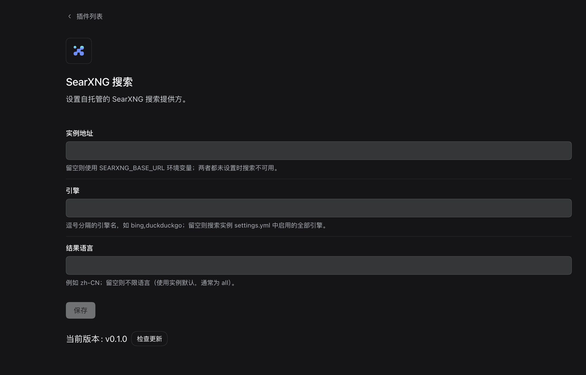

# dsh-web-search-searxng

[English](README.md) | **中文** | [日本語](README.ja.md)

[](LICENSE)
[](https://nodejs.org)
[](https://github.com/searxng/searxng)
[](https://github.com/deepseek-ai/deepseek-harness)

一个 [DeepSeek Harness](https://github.com/deepseek-ai/deepseek-harness)（dsh）插件：通过你自己托管的 [SearXNG](https://github.com/searxng/searxng) 元搜索实例，为 AI 智能体提供**免费、无限制、保护隐私的网页搜索**——**无需 API 密钥、没有按次计费的模型成本、查询记录不离开你的机器**。安装后还会在 Web 与桌面应用的 设置 → 插件 页添加 **SearXNG 搜索**卡片，实例地址、引擎限制与结果语言都可以在图形界面里直接编辑。



*设置 → 插件 页中的 SearXNG 搜索卡片——实例地址、引擎限制与结果语言，改动对下一次搜索立即生效，无需重启。*

## 为什么用 SearXNG 而不是搜索 API？

| | 托管搜索 API | **本插件** |
|---|---|---|
| 成本 | 按查询计费 | **免费**——你的实例、你的硬件 |
| API 密钥 | 必需，会轮换、会泄露 | **完全没有** |
| 隐私 | 查询发往第三方 | 查询只发往**你的** SearXNG，由它替你聚合 70+ 引擎 |
| 速率限制 | 有 | 只取决于你自己实例的限制 |
| 离线 / 内网可用 | 否 | 是——设计上支持回环地址与内网地址 |

## 功能特性

- 🔍 **元搜索提供方**——以稳定 id `searxng` 注册进 dsh 的 `ctx.web` 能力缝；每一次智能体网页搜索都由 `GET {baseURL}/search?format=json` 提供服务。
- 🖥️ **GUI 设置卡片**——设置 → 插件 页出现 **SearXNG 搜索**卡片；无需编辑配置文件即可修改实例地址、引擎限制与结果语言，改动对**下一次搜索立即生效，无需重启**。
- 🔒 **默认安全**——没有可泄露的凭据；HTTP 重定向直接失败（`WEB_PROVIDER_ERROR`），查询文本永远不会被重定向转发到别的源；403 响应会明确提示实例的 JSON 格式未启用。
- 🏠 **自托管友好**——回环地址（`http://localhost:8080`）、内网 IP、子路径挂载（`http://host/searxng`）全部支持，`/search` 会被正确拼接。
- 🌐 **引擎与语言控制**——通过 SearXNG 原生参数限制引擎（`bing,duckduckgo`）并偏好结果语言（`zh-CN`、`en`、`ja`……）。
- 📎 **可引用来源**——每条结果映射为带来源 URL、标题、引擎摘录（snippet）和发布日期（如有）的可引用对象，供智能体引用。
- ⚡ **消费者零构建**——`lib/` 已提交，从 git 地址安装即可直接使用。

## 工作原理

```
┌─────────────┐   网页搜索     ┌──────────────┐   JSON API   ┌────────────────┐
│  dsh 智能体 │ ─────────────▶ │ ctx.web 能力缝│ ───────────▶ │ 你的 SearXNG   │
│  (LLM)      │ ◀───────────── │ （searxng    │ ◀─────────── │ 实例           │
└─────────────┘   仅来源       │   提供方）   │   results[]  └───────┬────────┘
                               └──────────────┘                      │ 聚合
                                                          ┌──────────▼──────────┐
                                                          │ Google / Bing / DDG │
                                                          │ Brave / 70+ 引擎    │
                                                          └─────────────────────┘
```

SearXNG 不返回生成答案，因此结果只带**来源**——需要正文时智能体会自行用 `fetch` 读取页面。

## 前提条件

- 安装了带有 `ctx.web` 能力缝的 DeepSeek Harness（任何携带 `dsh-web` 的 dsh 版本）。
- Node.js `^22.19 || >=24`（仅开发需要；使用者只需 dsh）。
- 一个**启用 JSON 输出**的 SearXNG 实例——其 `settings.yml` 的 `search.formats` 必须包含 `json`（SearXNG 默认只提供 HTML）。

### 用 Docker 快速搭建 SearXNG

```sh
mkdir -p searxng && cd searxng
cat > settings.yml <<'EOF'
use_default_settings: true
server:
  secret_key: "换成一段足够长的随机字符串"
search:
  formats:
    - html
    - json   # ← 本插件必需
EOF
docker run -d --name searxng -p 8080:8080 \
  -v "$PWD/settings.yml:/etc/searxng/settings.yml" \
  searxng/searxng
```

验证 JSON 已启用：

```sh
curl "http://localhost:8080/search?q=test&format=json"
```

## 安装（导入 dsh）

**方式一 —— 从 GitHub 直接导入（跟踪最新 main）：**

```sh
dsh plugin --profile <名称> add https://github.com/Chaos-Paradox/dsh-web-search-searxng
```

**方式二 —— 指定发布版本（推荐，可复现）：**

```sh
dsh plugin --profile <名称> add https://github.com/Chaos-Paradox/dsh-web-search-searxng#v0.1.0
```

所有版本见 [Releases 页面](https://github.com/Chaos-Paradox/dsh-web-search-searxng/releases)。

**方式三 —— 本地克隆或 tarball：** 同一命令填绝对路径即可，例如 `dsh plugin --profile <名称> add /path/to/dsh-web-search-searxng`。无需构建——`lib/` 已提交。

安装会激活 bundle 的补丁层并注册提供方行。验证导入结果：

```sh
dsh plugin --profile <名称> list        # 应能看到 dsh-web-search-searxng
```

```sh
# 卸载
dsh plugin --profile <名称> remove dsh-web-search-searxng
```

## 配置与启用

注册不等于启用。两个开关都由你决定：

### 1. 指向你的实例

**方式 A —— GUI（推荐）：** 打开 **设置 → 插件 → SearXNG 搜索** 填写字段。所有字段在下一次搜索即生效，无需重启。

**方式 B —— 环境变量**，启动 dsh 前导出：

```sh
export SEARXNG_BASE_URL="http://localhost:8080"
```

| 字段 | GUI 标签 | 环境变量回退 | 说明 |
|---|---|---|---|
| `baseURL` | 实例地址 | `SEARXNG_BASE_URL` | SearXNG 实例基础地址，自动拼接 `/search`。留空 → 提供方报告不可用。 |
| `engines` | 引擎限制 | — | 逗号分隔的引擎白名单，例如 `bing,duckduckgo`。 |
| `language` | 结果语言 | — | 偏好的结果语言，例如 `zh-CN`、`en`、`ja`。 |

### 2. 选择它执行搜索

给 profile 的 `web` 行打补丁（补丁会整段替换一行的 config，因此需要重申 `fetchProvider`）：

```yaml
# $DSH_HOME/profiles/<名称>/cordis.patch.yml
- id: web
  config:
    searchProvider: searxng
    fetchProvider: http
```

想切回去，删掉这个补丁即可（或写 `searchProvider: deepseek-official`）。未配置端点时提供方报告不可用，不改变任何现有行为。

## 搜索返回什么

每项 SearXNG 结果映射为可引用的来源：

| SearXNG 字段 | dsh 来源字段 | 说明 |
|---|---|---|
| `url` | `url` | 缺失的条目被丢弃 |
| `title` | `title` | 空白时省略 |
| `content` | `snippet` | 引擎摘录 |
| `publishedDate` | `publishedAt` | 引擎提供时才有 |

`truncated` 恒为 `false`（`maxResults` 截断由 web 服务负责）；不附带生成式 `content` 答案，因为 SearXNG 没有可供能力缝担保的答案。

## 故障排查

| 症状 | 原因 | 解决办法 |
|---|---|---|
| `SearXNG error (HTTP 403); the instance may refuse JSON output` | `settings.yml` 的 `search.formats` 缺少 `json` | 按上文添加并重启容器 |
| 提供方不可用 / 无任何变化 | 未配置端点 | 填写卡片字段或设置 `SEARXNG_BASE_URL` |
| `search request failed` / ECONNREFUSED | 实例未运行或端口不对 | 检查 `docker ps`，用 curl 验证命令测试 |
| `WEB_PROVIDER_ERROR` 提到 redirect | SearXNG 前有代理发生重定向 | 将 `baseURL` 指向最终地址；重定向按设计直接失败 |
| `sources` 为空 | 引擎没有返回可用结果（或条目都缺 URL） | 放宽 `engines`，在浏览器里检查实例 |

## 开发

```sh
pnpm install        # 依赖全部来自 npm（@deepseek-ai/* 0.2.1-alpha.1 列车）
pnpm run build      # tsdown（宿主 + 浏览器双 bundle）+ tsc（浏览器声明）
pnpm test           # vitest：提供方行为、重定向策略、代理 egress、卡片表单
pnpm run typecheck  # tsc --noEmit
```

```
src/
  index.ts      插件入口：配置 schema、环境变量回退、提供方注册
  provider.ts   SearxngSearchProvider：JSON API 调用、结果映射、错误策略
  types.ts      SearXNG 响应类型
  client/       浏览器 bundle：设置 → 插件 页卡片（React）
tests/          vitest 套件，含重定向与 egress 策略
```

`lib/` 被刻意提交：从 git 地址安装时消费者直接拿到构建产物，无需构建链。**`src/` 变更后请重建并重新提交 `lib/`。**

已知缺口：卡片的 apply 级注册测试暂留在上游——已发布的 `@deepseek-ai/dsh-client-test-runtime` 引用了其 npm 包未携带的源文件，因此本仓库为其余卡片测试所需的两个 helper 保留了本地替身（`tests/helpers.ts`）。

## 参与贡献

欢迎 Issue 与 Pull Request。请保持提供方「无凭据」与「重定向失败关闭」这两条设计约束——它们是设计决策，不是缺失的功能。

## 许可证

[MIT](LICENSE) © [Chaos-Paradox](https://github.com/Chaos-Paradox)

## 相关链接

- [DeepSeek Harness](https://github.com/deepseek-ai/deepseek-harness)——宿主项目
- [SearXNG](https://github.com/searxng/searxng)——元搜索引擎
- [SearXNG JSON 格式文档](https://docs.searxng.org/admin/settings/settings_search.html)——启用 `search.formats`
