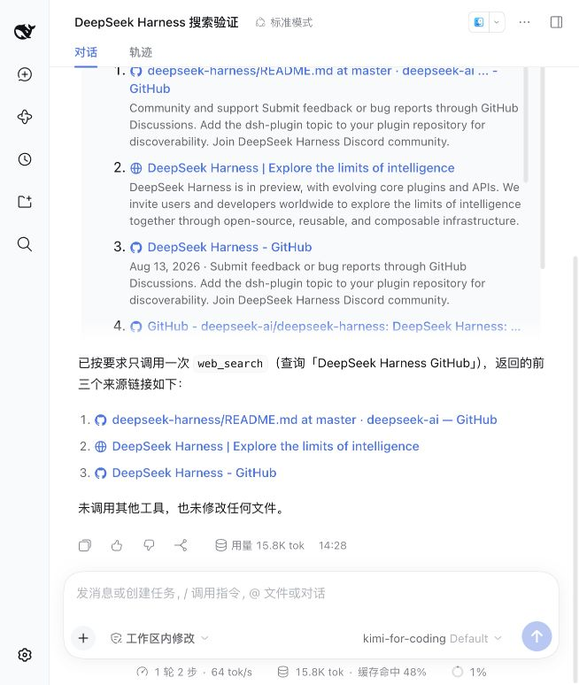

# Local compatibility validation — 2026-10-10

This is the historical 0.2.1 compatibility repair record. The changes are included in 0.3.0; see [managed-service validation](validation-managed-2026-10-10.md) for the current package.

## Result

Plugin 0.2.1 activates and routes search on unpatched DeepSeek Harness 0.2.1-alpha.2. Host checkout: `master`, `d743267388` (`Merge pull request #5946 from deepseek-harness/release-0.2.1-alpha.2`), with a clean working tree after validation. No companion patch or host source changes were applied. The full host build was already available; this task did not rerun the host's full build.

At that validation checkpoint, the actual `/Users/pioneer/.dsh/profiles/web` profile installed 0.2.1 from the local project link and has the bundle enabled. Its saved SearXNG settings are `baseURL: http://127.0.0.1:8080`, `engines: bing,yahoo`, and `allowOfficialFallback: false`. The endpoint is a temporary official SearXNG source instance started for this validation, not a managed service or an automatic startup installation. It must be replaced by a permanent deployment if continued use across restarts is desired.

## Checks executed

- `pnpm run typecheck` — passed in the host environment. The sandbox's pnpm dependency precheck attempted an interactive directory rebuild; earlier runs used `pnpm --config.verify-deps-before-run=false run typecheck` to execute the same compiler. This option only bypasses pnpm's automatic install precheck, not typechecking.
- `pnpm run build` and `pnpm --config.verify-deps-before-run=false run build` — passed; refreshed committed Host/Client bundles and declarations under `lib/`.
- `pnpm --config.verify-deps-before-run=false test` — 72 tests passed across 7 suites. Local proxy/redirect listeners required host execution because sandbox `listen()` raised EPERM. Published upstream client packages emitted missing source-map warnings without failing tests.
- `pnpm --config.verify-deps-before-run=false run test:host` — 9 tests passed using the current host's built packages. Includes real profile layers/package resolution, Include/Loader activation, HTTP requests/source mapping/result caps, volatile saves, default zero official calls, cancellation, unsupported opt-in, bundle toggles, actual PluginManager + pnpm removal in a disposable profile, user/home/CLI route priority, and home/CLI settings save refusal.
- `SEARXNG_BASE_URL=http://127.0.0.1:8080 pnpm --config.verify-deps-before-run=false run test:e2e` — 1 live query passed and returned citeable sources from official SearXNG with live engines. This is a connectivity and result-format smoke, not a new quality benchmark.
- `pnpm --config.verify-deps-before-run=false pack --pack-destination artifacts` — generated `artifacts/dsh-web-search-searxng-0.2.1.tgz`; includes routing YAML, built lib files and bilingual configuration notes. A fresh temporary Web profile installed the tarball and booted the full unpatched Web composition on port 3082.
- `git diff --check` — passed.

## Actual Web GUI

The actual profile was started through `pnpm dsh web --patch apps/web/tests/pin-browse-picker.overlay.yml --no-open --port 3081` (with pnpm's install precheck disabled). The browser rendered the SearXNG settings card, current version 0.2.1, the unsupported-fallback explanation, and bundle-specific restoration instructions. Saving the endpoint/engines succeeded. Disabling the installed bundle removed the card and exposed `web.config: { searchProvider: deepseek-official, fetchProvider: http }`; re-enabling restored the running provider and saved settings.

One browser-submitted task on the existing `kimi-for-coding` model called `web_search` once for “DeepSeek Harness GitHub”. Its actual tool card displayed 8 URL/title/snippet sources with the truncation notice, and the final answer listed three source links. It called no other tool and changed no files.

Automatic approval review rejected confirming an uninstall in the real profile, stating that removing that installed plugin lacked explicit authorization. The dialog was cancelled. Uninstall was instead exercised successfully with the real manager/pnpm operation in a disposable profile; the actual profile retains the enabled repair.

## Profile preservation

Before installation, profile manifests, locks, YAML and the original installed 0.2.0 package were backed up under `/Users/pioneer/.dsh/backups/searxng-compat-20261010-1425` with private permissions. A structural comparison confirms every original row in the user `cordis.patch.yml`, including model/provider, credential environment references, locale and other settings, is unchanged. The GUI's welcome-notice acknowledgement marker was restored to its original value. Only the new SearXNG settings row remains added.

The supported `dsh` launcher regenerated the profile's generated `cordis.yml` as its normal empty root; the old generated contents remain in the backup. No user route override or ownership journal was written. A local dependency link replaces the original GitHub spec; the package version and the source location match. A separate clean profile verified tarball installation because pnpm retained the development link when attempting to change this existing dependency's spec to a tarball.

## Remaining limits

Unpatched 0.2.1-alpha.2 has no public provider-specific search dispatch. Official fallback is therefore unavailable even when its preference is enabled; activation and successful SearXNG searches still work, and failures state that no official request was made. No credentials are copied and no official provider is constructed by this plugin. Disabling only the provider row leaves the bundle route selected and fails visibly. Whole-config overlays require explicit search and fetch choices for custom overrides. Disable/removal exposes current remaining layers and retains user settings, without a historical field rollback. See [configuration and upgrade notes](configuration.md).

Publication status for the current 0.3.0 work is recorded separately; this historical run did not publish a release.
