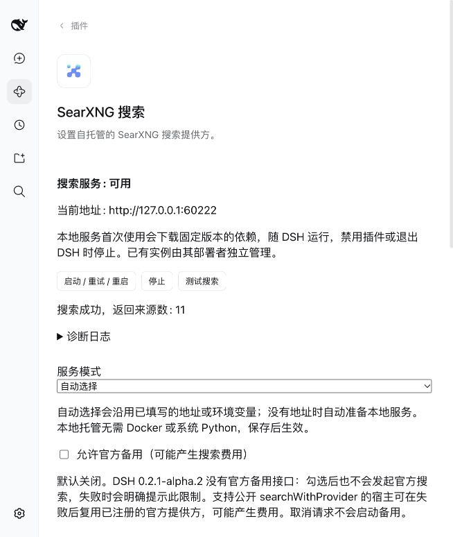

# Managed service validation — 2026-10-10

Plugin 0.3.0 adds automatic local SearXNG preparation and lifecycle management to the compatibility repair documented in [the earlier validation](validation-2026-10-10.md). The host remains unpatched DSH 0.2.1-alpha.2, checkout `d743267388`. No host source was changed.

## Automated checks

- Frozen dependency installation, typecheck and Host/Client build passed. Built files and declarations are committed under `lib/`.
- 96 tests passed across 12 suites, covering provider/fallback behavior, card settings and actions, archive verification and extraction, six platform asset selections, duplicate ownership, cancellation, bounded crash recovery, failed readiness cleanup, and late mounting/replacement of the host process service. Existing published client source-map warnings did not fail the suite.
- Nine built-artifact host composition tests passed: real profile layers, package resolution, Include/Loader, volatile saves, route priorities, cancellation, no paid fallback on the unpatched host, bundle disable/enable, and manager/pnpm removal in a disposable profile.
- `pnpm run test:managed` passed from an empty temporary directory using built JavaScript and the published public subprocess provider. It downloaded the managed runtime, returned three real search sources through `ctx.web`, reused the cached runtime on restart, verified HTTP shutdown after stopping and after plugin disposal, and removed temporary data.
- `pnpm pack` created `artifacts/dsh-web-search-searxng-0.3.0.tgz`. A new Web profile installed this actual tarball and booted the full Web composition on port 3084. The card reported a ready automatic service at an OS-selected loopback port without configuring an endpoint or system Python. Artifact contents include both bundles, routing YAML, declarations and bilingual setup notes.
- `git diff --check` passed.

## Full Web card

An isolated, keyless Web profile at `/tmp/dsh-managed-web-check` booted on port 3083. Initial full composition testing exposed a startup-order race: the web service could activate the plugin before `subprocess` was active. The runtime now waits through public Cordis dependency injection, starts automatically when that service becomes available, and disposes the old manager when the process service is replaced. The regression tests and subsequent full Web startup passed.

The authenticated card reported ready status and the actual managed endpoint. Saving Bing/Yahoo and simplified Chinese succeeded without restarting the service. Its direct SearXNG test returned 11 sources. Setting the local port to the already occupied 8080 displayed an address-in-use failure; the existing external service remained HTTP 200. Restoring port 0 restarted successfully with a newly allocated endpoint. Stop removed the endpoint and made the previous managed HTTP port unreachable; restart reused the cached runtime and returned to ready status. Search testing never uses the official fallback.

The two disposable Web servers were stopped after validation, and their owned SearXNG ports were checked for shutdown. These tests do not alter the real profile's existing endpoint or model settings. The real profile's previous manual 8080 service is separate from automatic management; `auto` preserves that saved endpoint, while choosing `local` switches to plugin ownership.

## Cross-platform scope

The first Actions run passed Linux/macOS and exposed a Windows build issue: the decorator-lowering hook matched only forward-slash paths, leaving syntax that Node cannot parse. The hook now accepts Windows separators, with parser regression tests for both path forms. The next run reached real Windows setup and exposed an unconditional Unix-only `pwd` import in the pinned Valkey adapter. A guarded, Windows-only source compatibility patch now preserves POSIX behavior and avoids account metadata for Windows connection-error logging. Expected-source checks and compatibility-version markers protect this patch.

The final [PR run](https://github.com/Chaos-Paradox/dsh-web-search-searxng/actions/runs/38034853680) and [push run](https://github.com/Chaos-Paradox/dsh-web-search-searxng/actions/runs/38034850884) both passed all three platform jobs at `7dd0d799e2903f537161a5e1ba321d87da8dba3b` on 2026-10-10. They cover frozen installation, typecheck, 96 tests, build, clean managed preparation and readiness, cached restart, stop and plugin teardown. PR #1 was squash-merged as `40985c5a0631b0b1662f99729edb35340bc7fa88` with the same implementation tree.

Local live testing covered macOS arm64 only. CI sets `SEARXNG_SMOKE_SEARCH=0` to test readiness and teardown without relying on upstream search-engine availability. The successful runs do not establish that every CPU architecture or Linux distribution works, or that real upstream searches succeed on every platform.

DSH peers require `>=0.2.1-alpha.2 <0.3.0`; only 0.2.1-alpha.2 was exercised. The host lacks public provider-specific official fallback, so optional fallback reports the capability limit and makes no paid request. First setup needs access to GitHub/PyPI; cached service startup needs no repeated install. No system startup service or PATH changes are made. See [managed runtime](managed-runtime.md) for pinned downloads, ownership and remaining limits.
